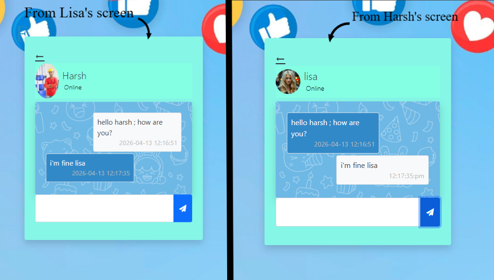

# Chetting (PHP Auth & Chat App) – A Simple PHP Chat Application

**Chetting** is a basic yet functional web-based chat application developed using **PHP**, **MySQL**, **HTML**, **CSS**, and **Bootstrap**. It focuses on creating a user authentication system with the ability to register new users, log in, upload a profile picture, and securely handle user sessions.

> This project was created as part of a learning exercise and demonstrates practical implementation of backend logic, session handling, and file upload features using PHP.

---



---

## 📌 Project Objective

The main objective of **Chetting** is to build a foundational chat platform where users can:
- Create an account with a name, username, password, and profile picture
- Log into the application using their credentials
- Be redirected to a dashboard or homepage after login
- (Future Scope) Chat with other registered users

This project also helps demonstrate how a PHP application interacts with a MySQL database and handles file uploads, user sessions, and basic security mechanisms.

---

## 🧰 Technologies Used

- **Frontend:**
  - HTML5
  - CSS3
  - Bootstrap 5
- **Backend:**
  - PHP 7+
  - PDO (PHP Data Objects) for database interaction
- **Database:**
  - MySQL (via phpMyAdmin or CLI)
- **Server:**
  - Apache (via XAMPP)

---

## 🧱 Core Features

- ✅ User Registration (Sign Up)
- ✅ Login with session management
- ✅ Profile Picture Upload
- ✅ Form validation and error handling
- ✅ Responsive UI using Bootstrap
- 🚧 Chat system placeholder for future feature

---


---

## ⚙️ How to Run the Project Locally

### 1. Install XAMPP

Download and install [XAMPP](https://www.apachefriends.org/). It includes Apache (for PHP) and MySQL.

### 2. Clone or Copy the Project

Place the project in your XAMPP `htdocs` directory:

```bash
C:\xampp\htdocs\chetting


